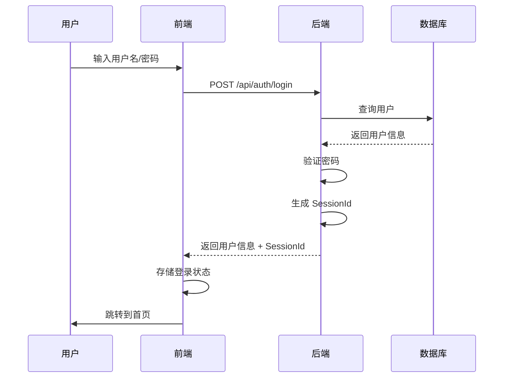
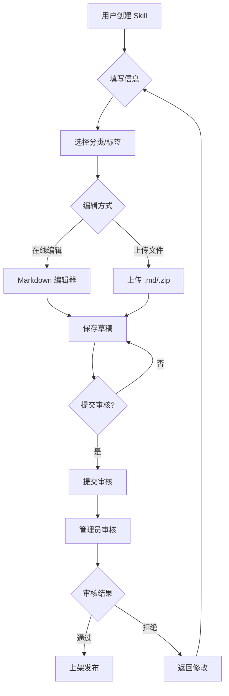
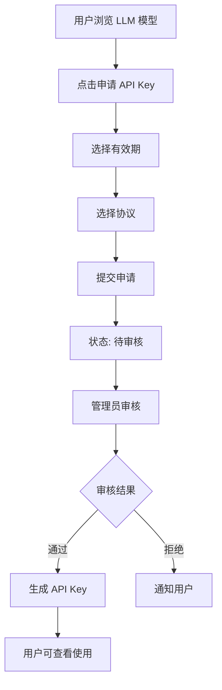

# AI Marketplace 产品需求文档 (PRD)

| 文档版本 | 日期 | 作者 | 变更说明 |
|---------|------|------|---------|
| v1.0 | 2026-02-26 | - | 初始版本 |

---

## 1. 产品概述

### 1.1 产品背景

企业内部 AI 能力快速发展的背景下，各部门和员工积累了大量有价值的 LLM 模型配置和 Skills（提示词模板）。但这些能力分散在不同团队和个人手中，缺乏统一的共享和管理平台，导致：

- **能力复用难**：优质的提示词模板需要重复发现和调试
- **资源浪费**：同样的模型配置被重复购买和配置
- **管理混乱**：缺乏统一的权限控制和审计机制
- **协作低效**：缺少能力评价和反馈机制

### 1.2 产品定位

**AI Marketplace** 是一个企业内部的 AI 能力共享平台，提供 LLM 模型和 Skills（提示词模板）的管理、发布、审核、使用功能。

**核心价值**：
- 统一管理企业内部的 AI 能力资产
- 促进能力复用，降低重复建设成本
- 规范化审批流程，确保质量和安全
- 积累企业知识资产

### 1.3 目标用户

| 用户类型 | 描述 | 核心诉求 |
|---------|------|---------|
| **普通用户** | 企业内部员工 | 发现和使用优质的 AI 能力，发布自己的 Skills |
| **管理员** | IT/平台部门人员 | 审核发布内容，配置 LLM 模型，管理平台运营 |

---

## 2. 产品功能

### 2.1 功能架构图

```
┌─────────────────────────────────────────────────────────────┐
│                        AI Marketplace                        │
├─────────────────────────────────────────────────────────────┤
│  用户门户              │  管理后台                           │
│  ├── LLM 模型浏览      │  ├── 资产管理                       │
│  ├── Skills 浏览       │  ├── 审核队列                       │
│  ├── 模型在线测试      │  ├── 分类管理                       │
│  ├── 能力发布          │  ├── LLM 模型配置                   │
│  ├── 我的收藏          │  └── 数据统计                       │
│  └── API Key 管理      │                                     │
├─────────────────────────────────────────────────────────────┤
│  核心能力                                                     │
│  ├── 认证授权  ├── 文件存储  ├── 审批流程  ├── 数据统计       │
└─────────────────────────────────────────────────────────────┘
```

### 2.2 功能列表

#### 2.2.1 用户认证

| 功能 | 描述 | 优先级 |
|------|------|--------|
| 用户登录 | 用户名/密码登录 | P0 |
| 权限控制 | 区分普通用户和管理员权限 | P0 |
| 登出 | 清除登录状态 | P0 |

#### 2.2.2 LLM 模型管理（用户端）

| 功能 | 描述 | 优先级 |
|------|------|--------|
| 模型浏览 | 查看已上架的 LLM 模型列表 | P0 |
| 模型详情 | 查看模型配置信息、使用说明 | P0 |
| 在线测试 | 直接在页面测试模型效果 | P0 |
| API Key 申请 | 申请使用模型的 API Key | P0 |
| 我的 API Key | 查看我的 API Key 列表和状态 | P0 |

#### 2.2.3 Skills 管理

| 功能 | 描述 | 优先级 |
|------|------|--------|
| Skills 浏览 | 查看已发布的 Skills 列表 | P0 |
| Skills 详情 | 查看 Skill 内容、使用示例 | P0 |
| 分类筛选 | 按分类筛选 Skills | P0 |
| 搜索 | 支持名称、描述、标签搜索 | P0 |
| 排序 | 最新、最热、下载量、点赞数 | P0 |

#### 2.2.4 资产发布

| 功能 | 描述 | 优先级 |
|------|------|--------|
| 创建 Skill | 在线编辑 Markdown 或上传文件 | P0 |
| 保存草稿 | 保存未完成的发布内容 | P0 |
| 提交审核 | 提交后进入审核队列 | P0 |
| 版本管理 | 支持多版本，当前版本展示 | P1 |
| 我的草稿 | 查看和管理草稿 | P0 |
| 我发布的 | 查看已发布的资产 | P0 |

#### 2.2.5 互动功能

| 功能 | 描述 | 优先级 |
|------|------|--------|
| 收藏 | 收藏感兴趣的资产 | P0 |
| 取消收藏 | 取消已收藏的资产 | P0 |
| 我的收藏 | 按类型筛选查看收藏 | P0 |
| 点赞 | 为优质资产点赞 | P0 |
| 浏览统计 | 记录浏览次数 | P0 |
| 下载统计 | 记录下载次数 | P0 |

#### 2.2.6 管理后台 - 资产管理

| 功能 | 描述 | 优先级 |
|------|------|--------|
| 资产列表 | 查看所有资产（全状态） | P0 |
| 资产详情 | 查看资产完整信息和版本历史 | P0 |
| 状态修改 | 修改资产状态（上架/下架） | P0 |
| 资产删除 | 删除不合规资产 | P0 |

#### 2.2.7 管理后台 - 审核系统

| 功能 | 描述 | 优先级 |
|------|------|--------|
| 审核队列 | 查看待审核的资产和 API Key 申请 | P0 |
| 审核通过 | 批准发布/申请 | P0 |
| 审核拒绝 | 拒绝发布/申请，可填写意见 | P0 |
| 审核记录 | 查看历史审核记录 | P0 |
| 外部工作流集成 | 预留审批回调接口 | P2 |

#### 2.2.8 管理后台 - 系统配置

| 功能 | 描述 | 优先级 |
|------|------|--------|
| LLM 模型配置 | 添加/编辑/删除 LLM 模型配置 | P0 |
| 分类管理 | 管理资产分类 | P0 |
| 审批流程配置 | 配置审批规则（预留） | P2 |

#### 2.2.9 管理后台 - 数据统计

| 功能 | 描述 | 优先级 |
|------|------|--------|
| 资产热度 | 浏览量、下载量、点赞数排名 | P0 |
| 用户活跃度 | 活跃用户数、发布资产数 | P1 |
| API Key 使用 | 使用情况统计 | P1 |

---

## 3. 非功能需求

### 3.1 性能要求

| 指标 | 要求 |
|------|------|
| 页面加载时间 | < 2 秒 |
| API 响应时间 | < 500ms（非流式接口） |
| 并发用户 | 支持 100+ 并发 |
| 文件上传 | 最大 50MB |

### 3.2 安全要求

| 指标 | 要求 |
|------|------|
| 认证 | 用户名密码认证 |
| 权限控制 | 基于角色的访问控制（RBAC） |
| 数据传输 | HTTPS（生产环境） |
| 文件类型限制 | 仅允许 .md、.zip |
| 文件大小限制 | 最大 50MB |

### 3.3 可用性要求

| 指标 | 要求 |
|------|------|
| 系统可用性 | > 99% |
| 数据备份 | 每日备份 |
| 故障恢复 | < 1 小时 |

### 3.4 兼容性要求

| 类别 | 要求 |
|------|------|
| 浏览器 | Chrome 90+, Edge 90+, Firefox 88+, Safari 14+ |
| 屏幕分辨率 | 1366x768 及以上 |
| 数据库 | PostgreSQL 12+ |
| JDK | Java 17 |

---

## 4. 数据模型

### 4.1 核心实体

```
用户 (User)
├── id: 用户ID
├── username: 用户名
├── password: 密码（加密）
├── email: 邮箱
├── department: 部门
└── role: 角色（user/admin）

分类 (Category)
├── id: 分类ID
├── name: 分类名称
├── asset_type: 资产类型（llm/skill）
└── sort_order: 排序

资产 (Asset)
├── id: 资产ID
├── asset_type: 类型（llm/skill）
├── name: 名称
├── description: 描述
├── category_id: 分类ID
├── tags: 标签
├── status: 状态（draft/pending_review/approved/rejected/offline）
├── current_version_id: 当前版本ID
└── created_by: 创建人ID

资产版本 (AssetVersion)
├── id: 版本ID
├── asset_id: 资产ID
├── version_no: 版本号
├── content: 内容（文本型）
├── storage_path: 存储路径（文件型）
├── view_count: 浏览量
├── download_count: 下载量
└── like_count: 点赞数

LLM 模型配置 (LlmModelConfig)
├── id: 配置ID
├── name: 模型名称
├── provider: 提供商
├── model_name: 模型标识
├── api_protocol: 协议（openai/anthropic）
├── api_endpoint: API 端点
└── status: 状态（active/inactive）

API Key (ApiKey)
├── id: Key ID
├── user_id: 用户ID
├── model_config_id: 模型配置ID
├── key_value: Key 值
├── status: 状态（pending/approved/rejected/expired）
├── expiry_type: 有效期类型（3m/6m/1y/permanent）
└── approver_id: 审批人ID

审核记录 (ApprovalRecord)
├── id: 记录ID
├── approval_type: 审批类型（asset/api_key）
├── target_id: 目标ID
├── reviewer_id: 审核人ID
├── status: 状态（approved/rejected）
└── comment: 审批意见

收藏 (Favorite)
├── id: 记录ID
├── user_id: 用户ID
├── asset_id: 资产ID
└── asset_type: 资产类型

点赞记录 (LikeRecord)
├── id: 记录ID
├── user_id: 用户ID
├── asset_id: 资产ID
└── asset_version_id: 资产版本ID
```

### 4.2 初始化数据

#### 预置用户
- 管理员：`admin` / `admin`

#### 预置 LLM 模型
- GLM-5（智谱AI）
- GLM-4.7（智谱AI）

#### 预置分类

**LLM 分类**：
- 通用对话
- 代码生成
- 数据分析
- 图像理解

**Skills 分类**：
- 文案写作
- 数据分析
- 代码辅助
- 翻译
- 总结摘要

---

## 5. 技术架构

### 5.1 技术栈

| 层级 | 技术选型 |
|------|---------|
| 前端 | Vue3 + Vite + TypeScript + Element Plus |
| 后端 | SpringBoot 2.6.5 + MyBatis Plus |
| 数据库 | PostgreSQL |
| 对象存储 | MinIO（测试）/ S3（生产） |

### 5.2 部署架构

```
┌─────────────────────────────────────────────────────────┐
│                       用户浏览器                         │
└────────────────────┬────────────────────────────────────┘
                     │ HTTPS
┌────────────────────▼────────────────────────────────────┐
│                    Nginx 反向代理                        │
└──┬───────────────────────────────────────────┬─────────┘
   │                                           │
   │ /api/*                                    │ /*
   ▼                                           ▼
┌──────────────┐                     ┌──────────────────┐
│  后端服务     │                     │   前端静态资源   │
│  (SpringBoot) │                     │   (Vue3 Build)  │
│  Port: 8080   │                     └──────────────────┘
└──┬───────────┘
   │
   ├──► PostgreSQL (10.254.254.103:5432)
   │
   └──► MinIO / S3 (对象存储)
```

---

## 6. 业务流程

### 6.1 用户登录流程



### 6.2 Skill 发布流程



### 6.3 API Key 申请流程



---

## 7. 页面原型

### 7.1 用户门户

| 页面 | 描述 |
|------|------|
| 登录页 | 用户名/密码登录，简洁设计 |
| 首页 | 平台概览，快捷入口 |
| LLM 模型列表 | 展示已上架的 LLM 模型，支持分类筛选和搜索 |
| LLM 模型详情 | 模型信息、在线测试、申请 API Key |
| Skills 列表 | 展示已发布的 Skills，支持分类筛选和搜索 |
 Skills 详情 | Skill 内容、操作按钮、统计信息 |
| 资产发布 | 表单填写、在线编辑器/文件上传 |
| 我的草稿 | 草稿列表，支持编辑/删除 |
| 我发布的 | 已发布资产列表，查看状态 |
| 我的收藏 | 收藏的资产，支持类型筛选 |

### 7.2 管理后台

| 页面 | 描述 |
|------|------|
| 资产管理 | 全部资产列表，支持状态筛选和操作 |
| 审核队列 | 待审核的资产和 API Key 申请 |
| 分类管理 | 分类列表，增删改操作 |
| LLM 模型配置 | 模型配置列表，增删改操作 |
| 数据统计 | 资产热度、用户活跃度、API Key 使用 |

---

## 8. 配置参数

### 8.1 环境配置

| 配置项 | 测试环境 | 生产环境 |
|--------|---------|---------|
| 数据库地址 | 10.254.254.103:5432 | 待定 |
| 数据库名称 | ai-marketplace | ai-marketplace |
| MinIO 地址 | 10.254.254.103:9001 | - |
| MinIO Bucket | ai-marketplace | - |
| S3 地址 | - | 待定 |
| 前端端口 | 5173 | - |
| 后端端口 | 8080 | 8080 |

### 8.2 业务参数

| 参数 | 值 | 说明 |
|------|---|------|
| 文件大小限制 | 50MB | 单文件最大 |
| 允许文件格式 | .md, .zip | 文件类型白名单 |
| API Key 有效期 | 3m（默认）/ 6m / 1y / permanent | 用户可选 |
| 分页大小 | 20 条 | 列表默认 |
| 支持 API 协议 | OpenAI, Anthropic | API Key 申请可选 |

---

## 9. 实施计划

### 9.1 版本规划

#### V1.0（MVP）
- 用户认证登录
- LLM 模型浏览和测试
- Skills 浏览
- Skill 发布（基础）
- 资产审核
- 收藏/点赞
- 管理后台基础功能

#### V1.1
- 版本管理
- 高级搜索和筛选
- 数据统计增强
- 前端 UI 美化

#### V1.2（未来）
- 外部工作流集成
- MCP/Tools 支持
- RBAC 权限增强

### 9.2 里程碑

| 阶段 | 内容 | 预估时间 |
|------|------|---------|
| 需求确认 | 需求梳理、PRD 编写 | 已完成 |
| 技术设计 | 架构设计、数据库设计 | 已完成 |
| 开发准备 | 项目搭建、环境配置 | 1 天 |
| 后端开发 | API 开发、数据库实现 | 5-7 天 |
| 前端开发 | 页面实现、交互开发 | 5-7 天 |
| 联调测试 | 前后端联调、功能测试 | 2-3 天 |
| 部署上线 | 环境部署、数据迁移 | 1 天 |

---

## 10. 风险与依赖

### 10.1 风险

| 风险 | 影响 | 应对措施 |
|------|------|---------|
| MinIO/S3 配置复杂 | 文件上传功能延迟 | 提前验证存储配置 |
| LLM API 兼容性 | 测试功能不稳定 | 预置测试模型，充分测试 |
| 审核流程变更 | 需求变更 | 预留扩展接口 |

### 10.2 依赖

| 依赖项 | 描述 | 状态 |
|--------|------|------|
| 数据库服务 | PostgreSQL 10.254.254.103:5432 | ✅ 已确认 |
| MinIO 服务 | MinIO 10.254.254.103:9001 | ✅ 已确认 |
| GLM API | 智谱AI GLM 模型 API | ✅ 已确认 |
| 外部工作流 | BPM 流程集成 | ⏸️ 预留 |

---

## 11. 附录

### 11.1 术语表

| 术语 | 说明 |
|------|------|
| LLM | Large Language Model，大语言模型 |
| Skills | 提示词模板，用于指导 LLM 产生特定输出的文本 |
| API Key | 用于调用 LLM API 的密钥 |
| 资产 | 平台中的可发布内容的统称（LLM、Skills 等） |
| MinIO | 开源对象存储服务，兼容 Amazon S3 API |

### 11.2 相关文档

- [AI Marketplace 设计文档](./plans/2026-02-25-ai-marketplace-design.md)
- [AI Marketplace 实施计划](./plans/2026-02-26-ai-marketplace-implementation.md)

---

**文档结束**
